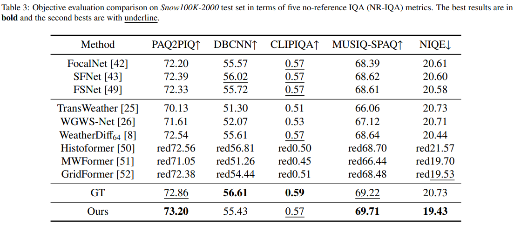

# SemiDDM-Weather: A Semi-supervised Learning Framework for All-in-one Adverse Weather Removal
<p align="center">
  
</p>

## Introduction
This is the official repository for our recently submitted paper "SemiDDM-Weather: A Semi-supervised Learning Framework for All-in-one Adverse Weather Removal", where more implementation details are presented.

## Abstract
Adverse weather removal aims to restore clear vision in adverse weather conditions. Existing methods are mostly tailored for specific weather types and rely heavily on extensive labeled data. This paper presents a pioneering semi-supervised all-in-one adverse weather removal framework by incorporating a Denoising Diffusion Model into the teacher-student network, termed SemiDDM-Weather. Specifically, we customize the wavelet diffusion model WaveDiff by adjusting its input and loss function to serve as the backbone of our SemiDDM-Weather. In addition, considering the risk of potentially inaccurate pseudo-labels can mislead the training of WaveDiff, we construct a reliable bank to store the ''best-ever'' outputs from the teacher network, wherein the combination of quality assessment and content consistency constraint determines the ''best-ever'' ones. Experimental results show that our SemiDDM-Weather achieves consistently visual high-quality and superior adverse weather removal over fully-supervised competitors on both synthetic and real-world datasets.

## Dependencies
- Ubuntu==18.04
- Pytorch==1.13.1
- CUDA==11.7

Other dependencies are listed in `requirements.txt`

## Usage

### 1. Prepare the dataset
We perform experiments for image deraining on [Snow100K](https://sites.google.com/view/yunfuliu/desnownet), combined image deraining and dehazing on [Outdoor-Rain](https://github.com/liruoteng/HeavyRainRemoval), and raindrop removal on
the [RainDrop](https://github.com/rui1996/DeRaindrop) datasets. 

### 2. Train the first stage
````bash
python train_first_stage.py --num_channels 12 --num_channels_dae 128 --num_timesteps 4 --num_res_blocks 2 --batch_size 196 --num_epoch 500 --ngf 64 --nz 100 --z_emb_dim 256 --n_mlp 4 --embedding_type positional --use_ema --ema_decay 0.9999 --r1_gamma 0.02 --lr_d 1.25e-4 --lr_g 1.6e-4 --lazy_reg 15 --ch_mult 1 2 2 2 --current_resolution 32 --attn_resolutions 16 --num_disc_layers 4 --rec_loss --net_type wavelet --use_pytorch_wavelet
````
### 3. Init the reliable bank
````bash
python init_reliable_bank.py --num_channels 12 --num_channels_dae 128 --num_timesteps 4 --num_res_blocks 2 --nz 100 --z_emb_dim 256 --n_mlp 4 --ch_mult 1 2 2 2  --crop_size 64 --current_resolution 32 --attn_resolutions 16 --net_type wavelet --use_pytorch_wavelet --path ./checkpoints/first_stage.pth
````
### 4. Train the second stage
````bash
python train_second_stage.py --num_channels 12 --num_channels_dae 128 --num_timesteps 4 --num_res_blocks 2 --batch_size 64 --num_epoch 650 --ngf 64 --nz 100 --z_emb_dim 256 --n_mlp 4 --embedding_type positional --use_ema --ema_decay 0.9999 --r1_gamma 0.02 --lr_d 1.25e-4 --lr_g 1.6e-4 --lazy_reg 15 --ch_mult 1 2 2 2 --current_resolution 32 --attn_resolutions 16 --num_disc_layers 4 --rec_loss --net_type wavelet --use_pytorch_wavelet
````

### 5. Test
The pre-trained path can be download from [GoogleDrive](https://drive.google.com/drive/folders/1LGgPV9YnwrB0dDTWxxgIey1qLxvDsHFw?usp=drive_link)
````bash
python test.py --num_channels 12 --num_channels_dae 128 --num_timesteps 4 --num_res_blocks 2 --nz 100 --z_emb_dim 256 --n_mlp 4 --ch_mult 1 2 2 2  --crop_size 64 --current_resolution 32 --attn_resolutions 16 --net_type wavelet --use_pytorch_wavelet --path ./checkpoints/second_stage.pth
````
### 6. Results
<details>
<summary><strong>Raindrop Removal</strong> (click to expand) </summary>
<p align="center"> </p>
  <p align="center"> </p>
</details>

<details>
<summary><strong>Image Deraining</strong> (click to expand) </summary>
<p align="center"> </p>
  <p align="center"> </p>
</details>

<details>
<summary><strong>Image Desnowing</strong> (click to expand) </summary>
<p align="center"> </p>
  <p align="center"> </p>
</details>

## Acknowledgement
* The training code architecture is based on the [Semi-UIR](https://github.com/Huang-ShiRui/Semi-UIR) and [WaveDiff](https://github.com/VinAIResearch/WaveDiff)and thanks for their work.
* We also thank for the following repositories: [IQA-Pytorch](https://github.com/chaofengc/IQA-PyTorch)
* Thanks for their nice contribution.
